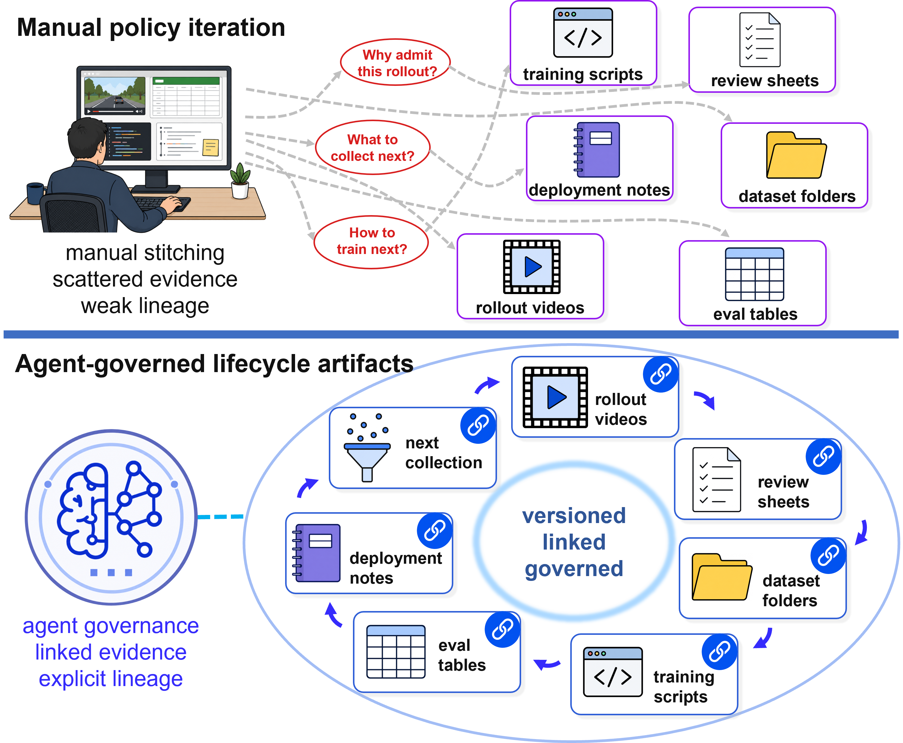
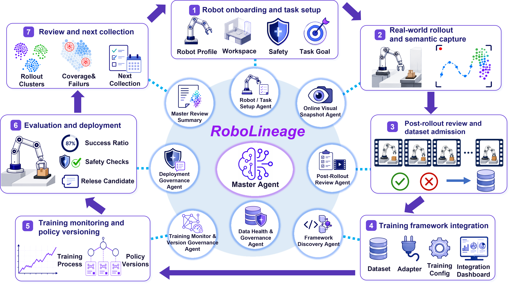

# RoboLineage

RoboLineage is an agent-native data lifecycle governance system for robot policy
iteration. It provides a portable lifecycle interface that links rollout
evidence, review decisions, dataset updates, training records, evaluations, and
next-collection plans through typed artifacts. The same interface can sit behind
different robot embodiments, data streams, and policy learners while keeping the
iteration traceable across time.

[Project page](https://robolineage.github.io/) |
[arXiv](https://arxiv.org/abs/2606.22142) |
[PDF](https://arxiv.org/pdf/2606.22142)



## Core Idea

Existing robot policy iteration often leaves the work between training runs to
expert reconstruction: which evidence mattered, why data changed, which
checkpoint used which dataset, and what should be collected next. RoboLineage
turns those transitions into linked lifecycle artifacts. Agents interpret
robotic evidence and prepare structured outputs, while schemas and artifact
boundaries keep lifecycle state inspectable, versioned, and reusable.



## Release Status

- [x] Lifecycle artifact schemas
- [x] Prompt contracts for lifecycle agents
- [x] Minimal artifact examples
- [x] Design notes for robot onboarding, review, data governance, training
      integration, evaluation, and recollection
- [ ] Schema validators and artifact scoring scripts
- [ ] Replay examples with mock model routes
- [ ] ROS2/runtime integration and frontend console components
- [ ] Training adapters and evaluation tools
- [ ] Additional real-robot examples

## Repository Layout

```text
assets/figures/                 Paper and project-page figures.
docs/                           Design notes for each lifecycle stage.
schemas/                        JSON schemas for typed lifecycle artifacts.
prompts/                        Prompt contracts for artifact-producing agents.
examples/mini_lifecycle/         Minimal artifact trace showing file format.
```

## Lifecycle Artifacts

RoboLineage treats robot policy iteration as a sequence of typed transitions:

```text
robot + task + collection context
  -> rollout evidence
  -> visual snapshots and post-rollout review
  -> dataset decision and dataset lock
  -> training record and policy metadata
  -> evaluation summary
  -> deployment recommendation and next-collection brief
```

Each artifact carries an identifier, parent links, producer metadata, timestamps,
and typed content. This lets downstream stages read from a stable interface
instead of relying on ad hoc folders, review sheets, local scripts, or expert
memory.

## Where to Start

- Read [docs/overview.md](docs/overview.md) for the system-level view.
- Read [docs/lifecycle_artifact_contract.md](docs/lifecycle_artifact_contract.md)
  for the artifact boundary.
- Read [docs/vsa_post_review.md](docs/vsa_post_review.md) for the online Visual
  Snapshot Agent and asynchronous post-rollout review pipeline.
- Read [docs/artifact_walkthrough.md](docs/artifact_walkthrough.md) for a
  step-by-step explanation of the mini lifecycle example.
- Read [docs/integration_path.md](docs/integration_path.md) for how to connect a
  new robot-learning workflow to the artifact interface.
- Read [docs/release_plan.md](docs/release_plan.md) for the staged public release
  plan.
- Inspect [examples/mini_lifecycle/artifact_trace.example.json](examples/mini_lifecycle/artifact_trace.example.json)
  for a compact example of linked artifacts.

## Citation

```bibtex
@article{luo2026robolineage,
  title={RoboLineage: Agent-Native Data Lifecycle Governance Across Robot Policy Iterations},
  author={Luo, Qian and Guo, Wentao and Qin, Zhennan and Guo, Nanchun and Zhao, Yunhan and Ma, Yi and Yang, Yanchao},
  journal={arXiv preprint arXiv:2606.22142},
  year={2026}
}
```

## License

This release is provided under the MIT License.
