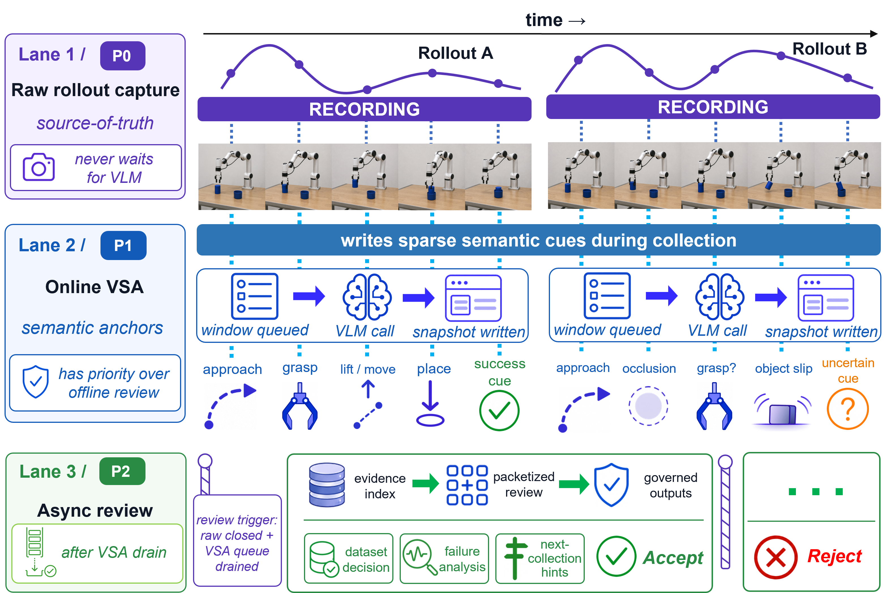

# Visual Snapshot and Post-Rollout Review

RoboLineage separates online semantic anchoring from asynchronous post-rollout
review. The online Visual Snapshot Agent (VSA) writes sparse task relevant anchors
during collection. Post-rollout review later reads those anchors together with
raw evidence and terminal observations to produce a governed review artifact.

## Online VSA

VSA is designed for low-latency feedback and evidence indexing. It can flag
events such as approach, grasp, occlusion, slip, placement, success cues, or
uncertain phases while raw recording continues. Its outputs are useful for
operator feedback and later search, but they are not final dataset decisions.

## Post-Rollout Review

Post-rollout review is stricter. It starts after raw capture closes and the VSA
queue is drained. It builds evidence packets, includes terminal observations,
checks task phases, and writes a review artifact with outcome, primary failure
phase, supporting evidence, uncertainty, and recommended routing.

## Why the Split

Raw recording should never wait for model calls. Online VSA gives quick semantic
anchors during collection, while post-rollout review can spend more time on
terminal evidence and packet-level consistency. The two-stage design keeps the
workflow responsive without letting early semantic guesses silently decide
training admission.
